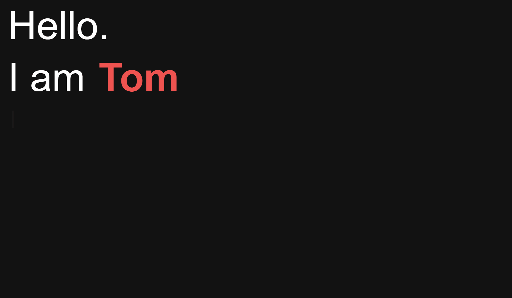

# :clapper: Portfolio Website

This is my custom portfolio website made using _HTML_, _CSS_ and _JavaScript_.

[](https://github.com/schmelto/Portfolio/graphs/contributors) [](https://schmelto.github.io/Portfolio/) [](https://github.com/schmelto) [](https://www.w3schools.com/html/) [](https://www.w3schools.com/js/) [](https://www.w3schools.com/css/)

The website is deployed to **GitHub Pages** and can be found [here](https://schmelto.github.io/Portfolio/).

[](https://schmelto.github.io/Portfolio/)

## Prerequisites

- [Git](https://git-scm.com/)
- [NodeJs](https://nodejs.org/)

## How to start

### Install and develop on local machine

To run the project localy on your computer please clone the project and run `npm install` to install all dependencies.

> This Project uses **[ESLint](https://eslint.org/)** and **[Prettier](https://prettier.io/)**.

Due the project only uses _HTML_, _CSS_ and _JavaScript_ you can access the website on you local machine by opening the `index.html`-file with your favorite browser.

### Add another project to the website

The projects shown on the website are being accessed through the [GitHub API](https://docs.github.com/en/rest) and can be maintained by modifing the [scripts.js](./js/scripts.js).

```js
let githubprojects = [
  {
    name: 'schmelto/100-days-of-code',
    icon: 'description',
  },
];
```

- **name**: username/repository (GitHub)
- **icon**: icon you want to diplay for the project (using [Google Font Icons](https://fonts.google.com/icons))

## Contribute

If you want to contribute to this project and make it better, your help is very welcome.

### Want to Help?

Want to file a bug, contribute some code, or improve documentation? Excellent! Check out one of our [issues](https://github.com/schmelto/Portfolio/issues).

### Code of Conduct

Help us keep this project open and inclusive. Please read and follow our [Code of Conduct](./CODE_OF_CONDUCT.md).

[](https://open.vscode.dev/schmelto/Portfolio)

### Love this project? Consider giving it a ⭐
